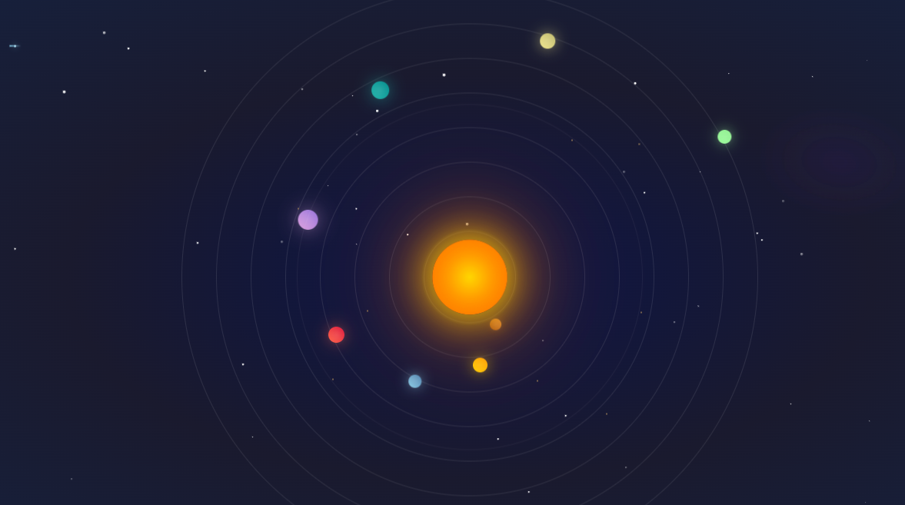

# 🌌 Cosmic Visualizer Pro

**Sistema de Visualizaciones Astronómicas Interactivas con Efectos Visuales Avanzados**

[](https://developer.mozilla.org/en-US/docs/Web/HTML)
[](https://developer.mozilla.org/en-US/docs/Web/CSS)
[](https://developer.mozilla.org/en-US/docs/Web/JavaScript)
[](https://developer.mozilla.org/en-US/docs/Web/API/Canvas_API)

## 📋 Descripción del Proyecto

**Cosmic Visualizer Pro** es una aplicación web interactiva que combina tres experiencias visuales únicas:

1. **Fondo Dinámico Razer** - Generador de ondas de color con efectos de onda
2. **Sistema Solar Interactivo** - Simulación astronómica con controles de cámara
3. **Sistema Solar V2** - Visualización CSS avanzada con efectos de paralaje



## ✨ Características Principales

### 🎨 Fondo Dinámico Razer
- **Generación de ondas** usando algoritmos de ruido 2D
- **Controles interactivos** para densidad, velocidad, ciclo de color y brillo
- **Efectos de perturbación** mediante interacción del mouse/touch
- **Optimización de rendimiento** con canvas y requestAnimationFrame

### 🌍 Sistema Solar Interactivo
- **Simulación realista** de los 8 planetas del sistema solar
- **Controles de cámara** con zoom, pausa y reset
- **Órbitas elípticas** con excentricidad realista
- **Interacción por clic** para enfocar planetas específicos
- **Movimiento de cámara** suave con interpolación

### ⭐ Sistema Solar V2
- **Animaciones CSS puras** para planetas y estrellas
- **Efectos de paralaje** en tiempo real
- **Generación dinámica** de cometas y estrellas
- **Cinturón de asteroides** animado
- **Efectos hover** interactivos

## 🚀 Tecnologías Utilizadas

- **Frontend**: HTML5, CSS3, JavaScript ES6+
- **Gráficos**: Canvas API 2D, CSS Animations
- **Matemáticas**: Algoritmos de ruido, trigonometría orbital
- **Interactividad**: Event Listeners, Touch Events
- **Rendimiento**: RequestAnimationFrame, Device Pixel Ratio

## 📁 Estructura del Proyecto

```
cosmic-visualizer-pro/
├── index.html              # Fondo Dinámico Razer
├── planet.html             # Sistema Solar Interactivo
├── planet_2.html           # Sistema Solar V2
├── css/
│   ├── style.css           # Estilos para Fondo Dinámico
│   ├── style_system_solar.css      # Estilos Sistema Solar
│   └── style_system_solar_v2.css  # Estilos Sistema Solar V2
├── js/
│   ├── script.js           # Lógica Fondo Dinámico
│   ├── script_system_solar.js      # Lógica Sistema Solar
│   └── script_system_solar_v2.js  # Lógica Sistema Solar V2
└── README.md               # Documentación del proyecto
```

## 🎮 Cómo Usar

### Fondo Dinámico Razer
1. Abre `index.html` en tu navegador
2. Ajusta la **densidad** de las ondas (8-64)
3. Controla la **velocidad** de animación (1-200)
4. Activa/desactiva el **ciclo de color**
5. Ajusta el **brillo** de los efectos (0-50)
6. **Haz clic o mueve el mouse** para perturbar las ondas

### Sistema Solar Interactivo
1. Abre `planet.html` en tu navegador
2. **Controla la velocidad** de rotación (0-3x)
3. **Ajusta el zoom** (0.35x-2.4x)
4. **Muestra/oculta etiquetas** y órbitas
5. **Haz clic en planetas** para enfocarlos
6. **Mueve el mouse** para control de cámara

### Sistema Solar V2
1. Abre `planet_2.html` en tu navegador
2. **Observa las estrellas** con efecto paralaje
3. **Interactúa con los planetas** (hover effects)
4. **Disfruta de los cometas** generados dinámicamente

## 🔧 Instalación y Configuración

### Requisitos Previos
- Navegador web moderno con soporte para:
  - HTML5 Canvas API
  - CSS3 Animations
  - JavaScript ES6+

### Instalación Local
1. **Clona o descarga** el proyecto
2. **Navega** al directorio del proyecto
3. **Abre** cualquiera de los archivos HTML en tu navegador
4. **No requiere servidor** - funciona directamente desde el sistema de archivos

### Desarrollo
```bash
# Clonar el repositorio
git clone https://github.com/Jeremias0618/Cosmic-Visualizer-Pro
cd cosmic-visualizer-pro

# Abrir en editor de código
code .

# Ejecutar en navegador
# Simplemente abre los archivos HTML en tu navegador preferido
```

## 🎯 Características Técnicas

### Algoritmos Implementados
- **Ruido 2D**: Generación de ondas orgánicas usando hash functions
- **Interpolación suave**: Transiciones de cámara con easing functions
- **Órbitas elípticas**: Cálculos astronómicos realistas
- **Efectos de paralaje**: Movimiento de capas a diferentes velocidades

### Optimizaciones de Rendimiento
- **Device Pixel Ratio**: Soporte para pantallas de alta densidad
- **RequestAnimationFrame**: Sincronización con el refresh rate
- **Canvas optimizado**: Redimensionamiento inteligente
- **Event listeners pasivos**: Mejora en scroll y touch

### Compatibilidad
- **Navegadores modernos**: Chrome, Firefox, Safari, Edge
- **Dispositivos móviles**: Touch events y responsive design
- **Pantallas de alta resolución**: Soporte para DPR > 1

## 🌟 Características Destacadas

- **Interfaz intuitiva** con controles visuales claros
- **Efectos visuales inmersivos** con estética gaming
- **Código modular** y bien estructurado
- **Documentación completa** en español
- **Sin dependencias externas** - 100% vanilla JavaScript

## 🎨 Personalización

### Modificar Colores
Los esquemas de color están definidos en los archivos CSS:
- **Fondo Dinámico**: Gradientes radiales y HSL
- **Sistema Solar**: Colores planetarios realistas
- **Efectos**: Sombras y brillos personalizables

### Ajustar Parámetros
Los valores de animación se pueden modificar en los archivos JavaScript:
- **Velocidades** de rotación y animación
- **Tamaños** de planetas y órbitas
- **Efectos** de cámara y transiciones

## 🤝 Contribuciones

Este proyecto está abierto a contribuciones. Para contribuir:

1. **Fork** el repositorio
2. **Crea** una rama para tu feature
3. **Commit** tus cambios
4. **Push** a la rama
5. **Abre** un Pull Request

## 📝 Licencia

Este proyecto está bajo la Licencia MIT. Ver el archivo `LICENSE` para más detalles.

## 👨‍💻 Autor

**Desarrollado con ♥ en JavaScript**

## 🔮 Roadmap Futuro

- [ ] **Modo VR/AR** para experiencias inmersivas
- [ ] **Más sistemas solares** y galaxias
- [ ] **Exportación de videos** de las animaciones
- [ ] **API para desarrolladores** externos
- [ ] **Modo colaborativo** multiusuario

## 📞 Soporte

Si tienes preguntas o encuentras problemas:

1. **Revisa** la documentación
2. **Busca** en los issues existentes
3. **Crea** un nuevo issue con detalles del problema

---

**¡Disfruta explorando el cosmos digital! 🌌✨**

